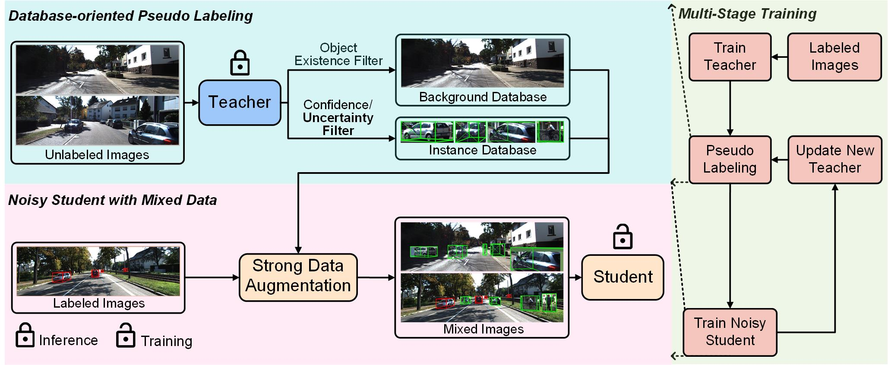

   

# Mix-Teaching: A Simple, Unified and Effective Semi-Supervised Learning Framework

# Introduction

This is the official implementation of our manuscript - [**Mix-Teaching: A Simple, Unified and Effective Semi-Supervised Learning Framework for Monocular 3D Object Detection**](https://arxiv.org/abs/2207.04448). The raw data of KITTI which consists of 48K temporal images is used as unlabeled data in all experiments. For more details, please see our paper.

The performance on KITTI validation set (AP3D) is as follows:
<table align="center">
    <tr>
        <td rowspan="2",div align="center">Models</td>
        <td colspan="3",div align="center">10%</td>    
        <td colspan="3",div align="center">50%</td>  
        <td colspan="3",div align="center">100%</td>  
    </tr>
    <tr>
        <td div align="center">Easy</td> 
        <td div align="center">Mod</td> 
        <td div align="center">Hard</td> 
        <td div align="center">Easy</td> 
        <td div align="center">Mod</td> 
        <td div align="center">Hard</td> 
        <td div align="center">Easy</td> 
        <td div align="center">Mod</td> 
        <td div align="center">Hard</td>  
    </tr>
    <tr>
        <td div align="center">MonoFlex</td>
        <td div align="center">5.76</td> 
        <td div align="center">4.67</td> 
        <td div align="center">3.54</td> 
        <td div align="center">21.91</td> 
        <td div align="center">15.43</td> 
        <td div align="center">13.09</td> 
        <td div align="center">23.64</td> 
        <td div align="center">17.51</td> 
        <td div align="center">14.83</td>  
    </tr>    
    <tr>
        <td div align="center">Ours</td>
        <td div align="center">14.43</td> 
        <td div align="center">10.65</td> 
        <td div align="center">8.41</td> 
        <td div align="center">29.34</td> 
        <td div align="center">20.63</td> 
        <td div align="center">17.31</td> 
        <td div align="center">29.74</td> 
        <td div align="center">22.27</td> 
        <td div align="center">19.04</td>  
    </tr>
    <tr>
        <td div align="center">Abs. Imp.</td>
        <td div align="center">+8.57</td> 
        <td div align="center">+5.98</td> 
        <td div align="center">+4.87</td> 
        <td div align="center">+7.43</td> 
        <td div align="center">+5.20</td> 
        <td div align="center">+4.22</td> 
        <td div align="center">+6.10</td> 
        <td div align="center">+4.76</td> 
        <td div align="center">+4.21</td>  
    </tr>
</table>

**Our code will be released no later than september 2022.**

# Acknowledgement
Many thanks to these excellent open source projects:
- [MonoFlex](https://github.com/zhangyp15/MonoFlex) 
- [GUPNet](https://github.com/SuperMHP/GUPNet)